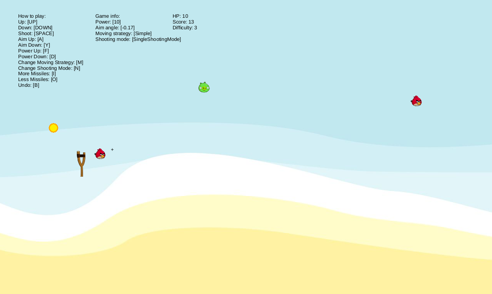

# ADP-game

Simple Java game project for demonstrating various design patterns made as semestral project for Architectural and Design Patterns course.

## Run App

*./gradlew run*

## Used Patterns

- Model-View-Controller
  - Architecture
- Observer
  - Communication between View and Model
- Null Object
  - Used for GameGraphics, removed
- Abstract Factory
  - Game object creation
- Visitor
  - Game object rendering
  - Sound player for missile shooting
- Singleton
  - GameObjectFactory
  - Memento CareTaker
- Strategy
  - Different missile moving strategies
- State
  - Shooting mode (Single, Double, Dynamic)
  - Enemy state (Alive, Injured, Dead, Removed)
- Memento
  - Game state
  - Used for storing state between commands
- Proxy
  - Accessing Model through Proxy only
- Command
  - CannonUp and CannonDown commands
  - Undo command
- Bridge
  - GameGraphics - bridge between JavaFXGraphics and our GameGraphics
- Decorator
  - For hits
- Mediator 
  - Communication between model modules